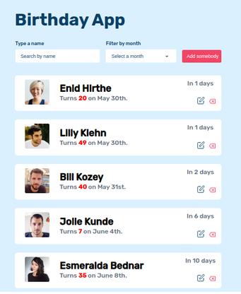

This project is built with HTML, CSS and vanilla JavaScript.

This web application was the first project I built with vanilla JavaScript. As a data source I used a JSON file. The purpose of it was to get myself familiar with JavaScript while practicing my knowledge of HTML and CSS at the same time. It enables users to keep track of their birthdays.

&nbsp;
**Features:**\
1- The list of birthday is sorted by the nearest birthday.\
2- Users can add their own birthday to the existing list.\
3- Users can edit their birth date, avatar or even their names.\
4- Users can remove some items from the list.\
5- The two input fields at the top of the list are used to filter birthday by name or by birthday month.

