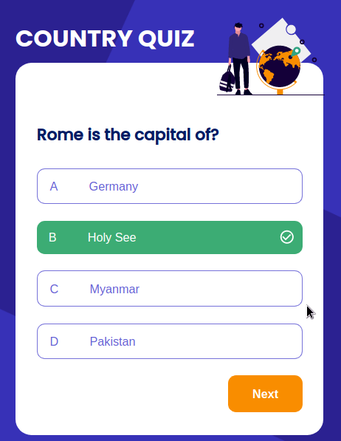

"This fun web application is built with React. It uses React hooks to share states across the entire components. It generates two random questions and four random options users can pick from. It is built for people to familiarize themselves with all of the countries’ names, flags and also its capital."
