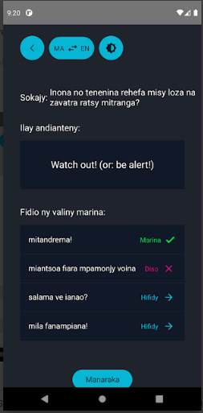

This application is built with React Native and uses React Redux for state management. It is built with a group of developers. It took us about a couple of months to complete this application. It allows users to learn both Malagasy and English languages. It is already published in the store and you can have a look at it [here](https://play.google.com/store/apps/details?id=com.learngasy&hl=en&gl=US).

&nbsp;
**Features:**\
1- It is a flash-card application where there are some options users can pick from.\
2- It supports both light and dark theme.\
3- Users can add more phrases to each category.\
4- There are several pages in this project like home page, learn page, correct and incorrect pages.

